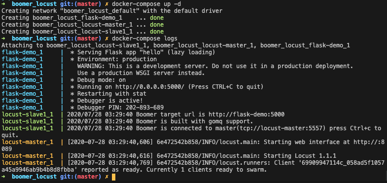
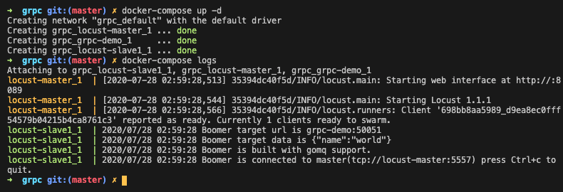

## Boomer_locust

Distributed pressure measurement for docker & k8s. Using Boomer locust with prometheues and grafana.

View testerhome for more details: https://testerhome.com/topics/24828

Contact me on QQ group: 552643038

## Usage

### HTTP/HTTPS

To run http/https examples:

```
# get code
git clone git@github.com:ShaoNianyr/boomer_locust.git
cd boomer_locust

# run server with docker-compose
docker-compose up -d

# view your urls
locust http://localhost:8089
```

Success:



Set slave targetUrl:

```
locust-slave1:
    image: shaonian/locust-slave:latest
    command:
      - ./target
      - --master-host=locust-master
      - --master-port=5557
      - --url=http://flask-demo:5000
```

You can set the targetUrl by using '--url'.

TargetUrl in docker is combined by image_name and port.

TargetUrl in k8s is combined by svc_name.namspace and port.

### gRPC

To run grpc examples:

```
# get code
git clone git@github.com:ShaoNianyr/boomer_locust.git
cd boomer_locust/grpc

# run server with docker-compose
docker-compose up -d

# view your urls
locust http://localhost:8089
```

Success:



Set slave targetUrl and targetData:

```
locust-slave1:
    image: shaonian/locust-slave-rpc:latest
    command:
      - ./helloworld.pb
      - --master-host=locust-master
      - --master-port=5557
      - --url=grpc-demo:50051
      - --data={"name":"world"}
```

You can set the targetUrl and targetData by using '--url' and '--data'.

TargetUrl in docker is combined by image_name and port.

TargetUrl in k8s is combined by svc_name.namspace and port.

### Grafana

If you need grafana，please uncomment the following codes in your docker-compose.yml.

```
  # prometheus:
  #   image: prom/prometheus
  #   volumes:
  #     - ./prometheus.yml:/etc/prometheus/prometheus.yml
  #     - ./prometheus/data:/root/prometheus/prometheus-data
  #   links:
  #     - locust-master
  #   ports:
  #     - "9090:9090"

  # grafana:
  #   image: grafana/grafana
  #   volumes:
  #     - ./grafana/data:/var/lib/grafana
  #   links:
  #     - prometheus
  #   ports:
  #     - "3000:3000"
```

Grafana Dashboard:


## Detail

For more detail, view testerhome: https://testerhome.com/topics/24828

## Contributing

[locust](https://github.com/locustio/locust)

[boomer](https://github.com/myzhan/boomer)

## License

Open source licensed under the MIT license (see LICENSE file for details).
