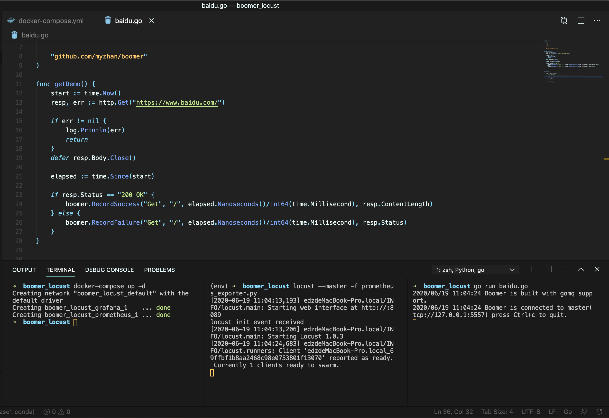
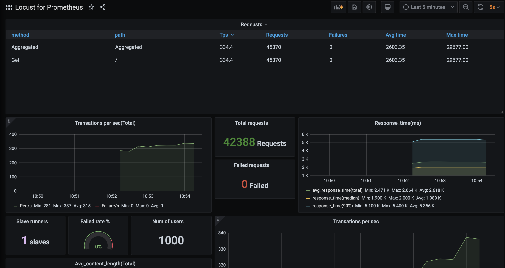

## Boomer_locust

Boomer locust with prometheues and grafana example. Using docker-compose.yml.

## Usage

```
# get code
git clone git@github.com:ShaoNianyr/boomer_locust.git
cd boomer_locust

# add venv
python3 -m venv env .

# activate venv
source env/bin/activate

# install locust
pip3 install locust

# vi prometheus.yml
targets: ['your_ip:8089']  # replace your real ip

# install and run grafana & prometheus
docker-compose up -d

# run locust master
locust --master -f prometheus_exporter.py

# run goland slave
go run baidu.go

# view your urls
grafana http://localhost:3000
locust http://localhost:8089
```

## View





## Contributing

[locust](https://github.com/locustio/locust)

[boomer](https://github.com/myzhan/boomer)

## License

Open source licensed under the MIT license (see LICENSE file for details).