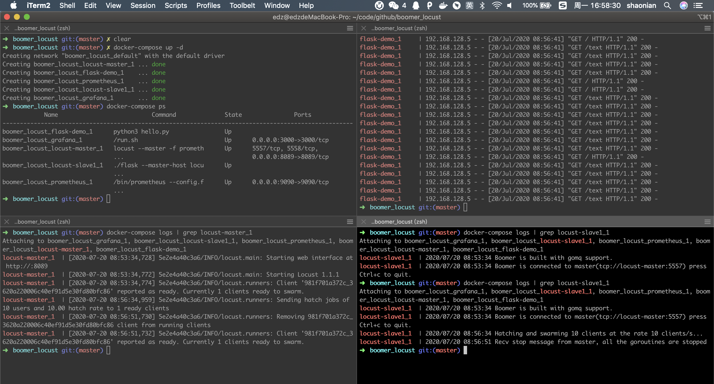
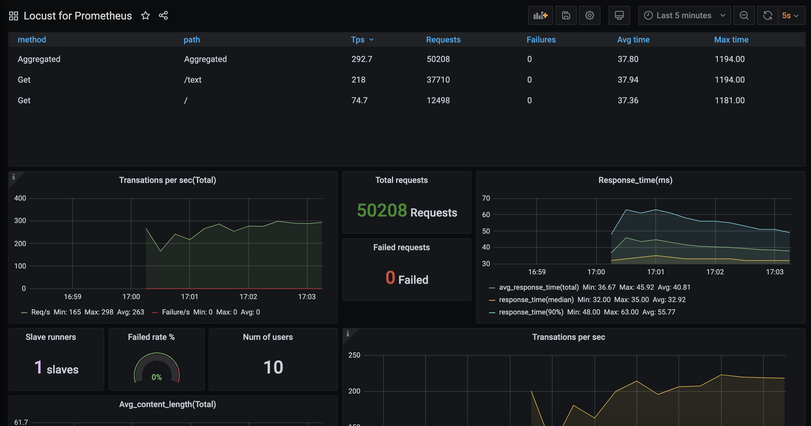
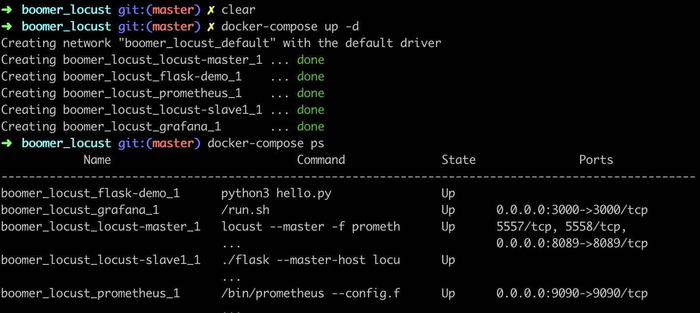
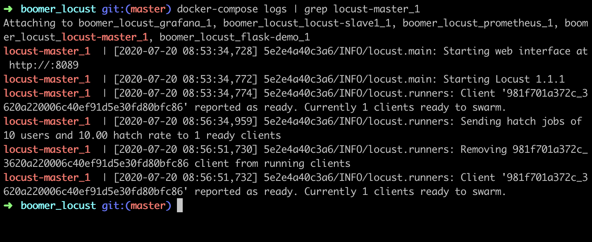
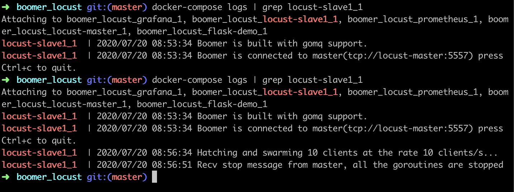
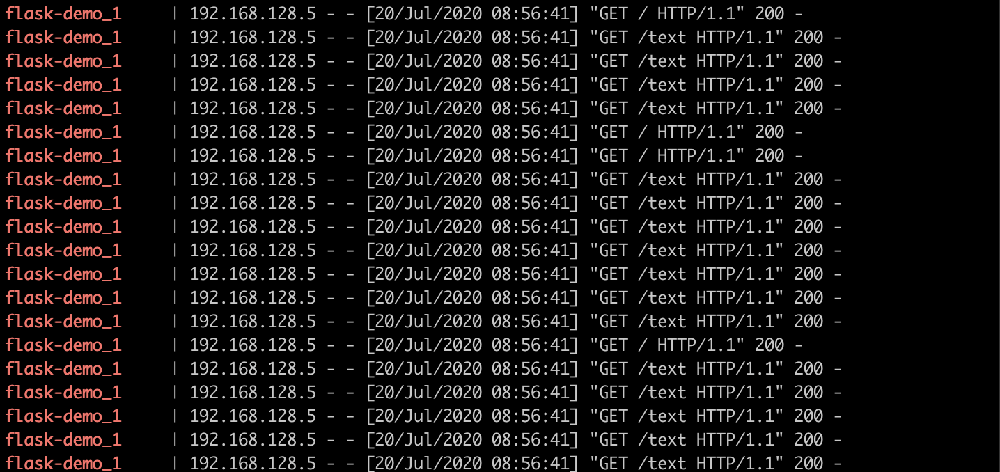
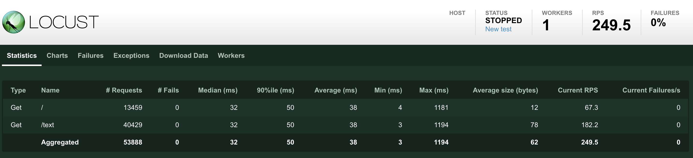

## Boomer_locust

Boomer locust with prometheues and grafana example. Using docker-compose.yml.

View testerhome for more details: https://testerhome.com/topics/24828

## Usage

```
# get code
git clone git@github.com:ShaoNianyr/boomer_locust.git
cd boomer_locust

# add venv
python3 -m venv env .

# activate venv
source env/bin/activate

# install locust
pip3 install locust

# install and run grafana & prometheus
docker-compose up -d

# view your urls
grafana http://localhost:3000
locust http://localhost:8089
```

## View





## Detail



如上图所示，flask-demo 是一个简易的服务器，我已经取消了对外暴露的访问，只有在集群内部才能访问到，于此同时，locust-master & locust-slave 也作为一个容器服务，同在一个集群网络中。locust-master & locust-slave & flask-demo 的镜像均已打包好， docker-compose.yml 详情如下:

```
version: '2'
services:
  prometheus:
    image: prom/prometheus
    volumes:
      - ./prometheus.yml:/etc/prometheus/prometheus.yml
      - ./prometheus/data:/root/prometheus/prometheus-data
    links:
      - locust-master
    ports:
      - "9090:9090"

  grafana:
    image: grafana/grafana
    volumes:
      - ./grafana/data:/var/lib/grafana
    links:
      - prometheus
    ports:
      - "3000:3000"

  flask-demo:
    image: shaonian/flask-demo:latest

  locust-master:
    image: shaonian/locust-master:latest
    ports:
      - "8089:8089"

  locust-slave1:
    image: shaonian/locust-slave:latest
    command:
      - ./flask
      - --master-host
      - locust-master
    links:
      - locust-master
      - flask-demo

  # locust-slave2:
  #   image: shaonian/locust-slave:latest
    # command:
    #   - ./flask
    #   - --master-host
    #   - locust-master
    # links:
    #   - locust-master
    #   - flask-demo
```



locust-master 启动以后开始监听有没有 slave 连上。



locust-slave 启动以后开始根据指定的 master-host 进行连接。

此时 locust-master & locust-slave 已经建立了通信。

现在我们来对内部网络的 http://flask-demo:5000/ & http://flask-demo:5000/text 这个两个路由进行 1:3 比重的压测访问。这里的 host 不再是传统的 URL，而是一个容器服务的名字。



此时查看 flask-demo 的容器日志，发现压力已经正常产生。

此时原生 locust 图表展示如下:



两个路由的比重满足 1:3 的条件。

此时 grafana & promethues 的扩展图表展示如下:


此时，各组件间通信建立成功，集群内部压力产生成功，压力图表扩展成功。

图片若不能查看，或想更多细节，请前往 testerhome: https://testerhome.com/topics/24828

## Contributing

[locust](https://github.com/locustio/locust)

[boomer](https://github.com/myzhan/boomer)

## License

Open source licensed under the MIT license (see LICENSE file for details).